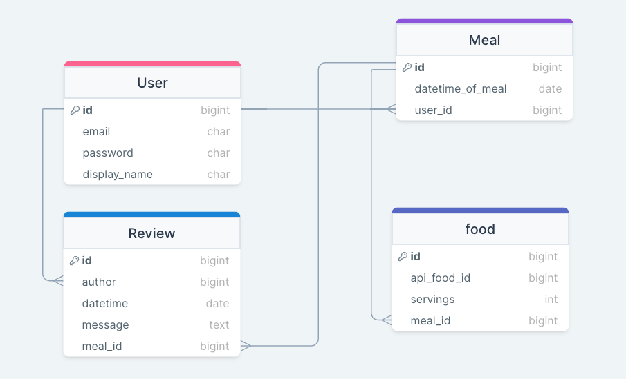

# Munch Memo

> CP Whiskey Platoon Personal Capstone Project

Munch Memo is an educational project designed to allow users to keep track of how many calories they are consuming. It uses [FatSecret API](https://platform.fatsecret.com/platform-api) to keep track of the calories, and [OpenAI API](https://platform.openai.com/) to allow users to generate meals based on a desired calorie count. It also allows users to view the meals of other users and to comment on these meals. Check it out here - [Munch Memo](https://munch-memo.duckdns.org/)

## Requirements and Architecture

> Requirements

We were required to create an application that utilizes two external APIs and has two CRUDable sources (not including user authentication). Here users are able to perform CRUD capabilities on the Meals they have eaten by adding/delete meals, and updating the servings of foods in those meals. Additionally, users can perform CRUD capabilities on other User's meals by commenting on their meals.

> Architecture

Munch Memo is built with React w/ Javascript to make the front-end and Django w/ Django Rest Framework and a PostgreSQL database to make the back-end.

> Deployment

Munch Memo is securely deployed on an AWS EC2 instance with an SSL certificate ensuring encrypted connections. Token authentication via cookies enhances security, safeguarding user authentication details.

## Founders

The Members and Developers of this project are:

- [Jordan Edgington](https://github.com/Jordan-Edgington)

